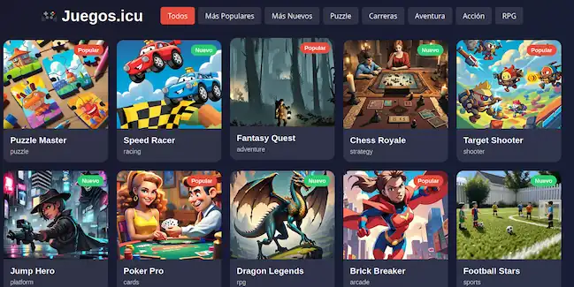

# juegos.icu

## Descripción

Este proyecto es una demostración funcional de un sitio web dinámico creado con **Node.js** y el motor de plantillas **EJS**. Utiliza JavaScript para generar páginas de juegos a partir de archivos JSON que contienen los datos.

El sitio incluye una página principal y subpáginas generadas dinámicamente para cada juego, dependiendo de la información en los archivos `games.json` e `independientes.json`.

No contiene el contenido original del sitio final, solo una base funcional para mostrar cómo se puede construir una web interactiva usando datos externos y plantillas EJS.

## Características

- Uso de **EJS** como motor de plantillas.
- Backend en **Node.js** con Express.
- Carga dinámica de datos desde archivos `.json`.
- Generación de subpáginas automáticas según el juego seleccionado.
- Interfaz funcional con **JavaScript** sin frameworks de frontend.
- Archivos multimedia y estilos en la carpeta `/public`.

## Capturas de pantalla

  
_Página principal _

  
_Ejemplo de subpágina generada _

## Archivos importantes

- `app.js`: Servidor principal con Express.
- `games.json` y `independientes.json`: Datos de juegos.
- `views/`: Plantillas EJS del sitio.
- `public/`: Archivos estáticos (CSS, imágenes, JS).

